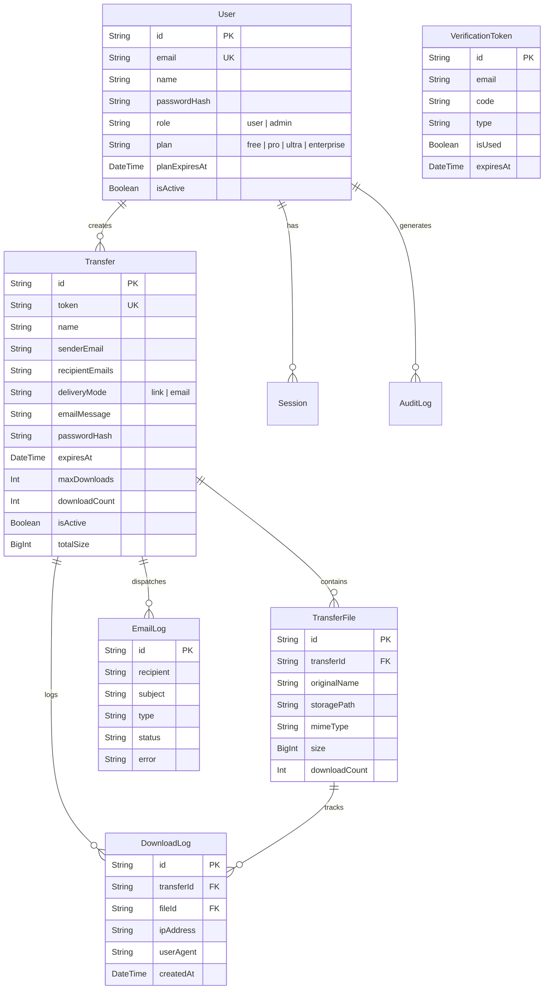

# ⚡ DropLync — Ultra-Fast, Secure Large File Sharing Platform

<p align="center">
  
  
  
  
  
  
</p>

**DropLync** is a modern, enterprise-ready large file transfer and sharing web application engineered for speed, privacy, and seamless user experience. Built with Next.js 14 App Router, Prisma ORM, and high-performance chunked file streaming, DropLync lets users upload, protect, distribute, and manage files effortlessly.

---

## 📑 Table of Contents

- [🌟 Features Overview](#-features-overview)
- [🏗️ System Architecture & Tech Stack](#️-system-architecture--tech-stack)
- [📁 Project Directory Structure](#-project-directory-structure)
- [⚙️ Environment Variables](#️-environment-variables)
- [🚀 Getting Started](#-getting-started)
- [💎 Subscription Plans](#-subscription-plans)
- [🔌 API Routes Specification](#-api-routes-specification)
- [🗄️ Database Schema & Data Models](#️-database-schema--data-models)
- [🎨 UI/UX & Interactive Design Elements](#-uiux--interactive-design-elements)
- [🛡️ Security & Privacy](#️-security--privacy)
- [🧹 Background Maintenance & Cron](#-background-maintenance--cron)
- [📜 Available Scripts](#-available-scripts)

---

## 🌟 Features Overview

### 📤 1. Smart File Transfer Hub (Landing Page)
- **High-Capacity File Uploads**: Stage and send multiple files simultaneously with drag-and-drop or file browser picker.
- **Dual Delivery Modes**:
  - **Link Delivery**: Instant unique shareable link (`/f/[token]`) with copy-to-clipboard functionality.
  - **Email Notification**: Automated email delivery to single or multiple recipient email addresses with custom sender notes.
- **Dynamic Chunked Streaming**: Smooth file uploads with real-time byte counters and progress percentage indicators.
- **End-to-End Transfer Security**:
  - Optional bcrypt-hashed password protection for download links.
  - Configurable expiration periods (1 day, 7 days, 30 days, up to 365 days).
  - Maximum download count limits to prevent link leaks.
- **No-Friction Anonymous Transfers**: Upload and share files without requiring immediate sign-up (utilizing Free Starter tier rules).

### 📥 2. Recipient Download Gateway (`/f/[token]`)
- **Password-Gated Access**: If secured, prompts recipient for password before revealing file metadata.
- **Individual File Streaming**: Download individual files with instant zero-buffer streaming.
- **One-Click Batch ZIP Download**: Uses `archiver` to stream-compress all transfer files into a single `.zip` archive on the fly without loading everything into memory.
- **Transfer Status Indicators**: Real-time display of total size, remaining downloads, expiration countdown, and sender details.

### 📊 3. User Dashboard (`/dashboard`)
- **Transfer Management**: Complete history of uploaded transfers with direct share links.
- **Active Links Control**: Deactivate or permanently delete active transfers on demand.
- **Metrics & Analytics**: View download counts, recipient delivery status, and expiration timestamps.
- **Account Tier Overview**: View current plan tier, max upload limits, and direct upgrade access.

### 🛡️ 4. Admin Control Center (`/admin`)
- **System-Wide Analytics**: Real-time metrics for total registered users, active transfers, aggregated bandwidth served, and total storage consumed.
- **Global Transfer Management**: Inspect all live transfers across the platform, search by sender/token, and force-purge transfers or files.
- **User Management**: View user roles (`admin` / `user`), account statuses, and plan subscriptions.
- **Audit Logging**: Comprehensive IP tracking and event logs for security oversight.

### 🔐 5. Mandatory Email OTP Authentication & Security
- **Strict Email Verification**: Accounts can only be created once the 6-digit OTP sent to the user's email address is verified.
- **Passwordless Sign-In & Registration**: Fast, frictionless 6-digit OTP delivery directly via live Gmail SMTP or custom mail servers.
- **Secure Password Integration**: Optional bcrypt password hashing configured seamlessly during or after OTP verification.
- **JWT Session Tokens**: Stored in HTTP-only, secure cookies with database session verification.
- **Google OAuth Integration**: Ready for 1-click single sign-on authentication.


---

## 🏗️ System Architecture & Tech Stack

| Layer | Technology | Details |
| :--- | :--- | :--- |
| **Framework** | Next.js 14 (App Router) | Server components, Route Handlers, API streaming |
| **Language** | TypeScript 5 | Strict type checking across API and UI |
| **Frontend Styling** | Tailwind CSS + Vanilla CSS | Dark futuristic glassmorphism theme, dynamic gradients |
| **Database** | SQLite (`dev.db`) | Local ACID-compliant database (configurable to PostgreSQL/MySQL) |
| **ORM** | Prisma ORM 5.7.0 | Type-safe database queries, schema migrations & Prisma Studio |
| **Archive & Compression** | Archiver 6.0 | High-performance ZIP streaming for bulk downloads |
| **Authentication** | Custom JWT + Sessions | Cookie-based session management with SHA-256 tokens |
| **Email Service** | Nodemailer | Gmail SMTP integration with formatted HTML email templates |
| **Interactive UX** | Web Audio API + CSS 3D | Dynamic sound feedback synthesizer and 3D tilt micro-interactions |

---

## 📁 Project Directory Structure

```
droplync/
├── app/                              # Next.js 14 App Router
│   ├── (auth)/                       # Authentication Route Group
│   │   ├── layout.tsx                # Auth layout wrapper
│   │   ├── login/page.tsx            # Login page (Password & OTP)
│   │   └── register/page.tsx         # Account registration page
│   ├── admin/                        # Admin Portal
│   │   └── page.tsx                  # Admin dashboard & analytics page
│   ├── api/                          # Serverless Route Handlers
│   │   ├── admin/                    # Admin API endpoints
│   │   │   ├── stats/route.ts        # Platform statistics & storage usage
│   │   │   ├── transfers/route.ts    # Transfer management for admins
│   │   │   └── users/route.ts        # User moderation & role controls
│   │   ├── auth/                     # Authentication API endpoints
│   │   │   ├── google/route.ts       # Google OAuth handler
│   │   │   ├── login/route.ts        # Email/password authentication
│   │   │   ├── logout/route.ts       # Session invalidation & cookie clear
│   │   │   ├── me/route.ts           # Current authenticated user fetcher
│   │   │   ├── otp/                  # OTP send & verify endpoints
│   │   │   └── register/route.ts     # User registration endpoint
│   │   ├── cron/                     # Automated cleanup cron route
│   │   │   └── route.ts              # Purges expired files and transfers
│   │   ├── share/                    # Public download endpoints
│   │   │   └── [token]/              # Token-specific download routes
│   │   │       ├── download-all/     # ZIP stream all files
│   │   │       ├── files/[fileId]/   # Stream specific single file
│   │   │       ├── verify/           # Password verification for protected links
│   │   │       └── route.ts          # Transfer metadata endpoint
│   │   ├── transfers/                # User transfer endpoints
│   │   │   ├── [id]/route.ts         # Update / Delete transfer
│   │   │   └── route.ts              # Create transfer & list user transfers
│   │   ├── uploads/                  # File chunk upload handlers
│   │   │   ├── [fileId]/route.ts     # Chunk payload receiver
│   │   │   └── initiate/route.ts     # Chunk upload session initializer
│   │   └── user/                     # User settings & subscription
│   │       └── subscription/route.ts # Manage user plan tiers
│   ├── dashboard/                    # User Dashboard
│   │   └── page.tsx                  # Transfers history & metrics
│   ├── f/[token]/                    # Download landing page
│   │   └── page.tsx                  # Download UI with preview & ZIP options
│   ├── pricing/page.tsx              # Pricing & plans showcase
│   ├── privacy/page.tsx              # Privacy policy document
│   ├── security/page.tsx             # Security whitepaper & architecture
│   ├── terms/page.tsx                # Terms of Service document
│   ├── globals.css                   # Global styles & glassmorphic classes
│   ├── layout.tsx                    # Root layout with Navbar & sound effects
│   └── page.tsx                      # Main Landing Page / Upload Hub
├── components/                       # Reusable React UI Components
│   ├── ui/                           # Primitive UI widgets
│   │   ├── AnimatedWord.tsx          # Dynamic word rotator
│   │   ├── Icons.tsx                 # SVG icon registry
│   │   ├── Tilt3D.tsx                # 3D mouse-tracking card container
│   │   └── UpgradeModal.tsx          # Plan upgrade modal dialog
│   ├── AdminClient.tsx               # Admin panel interactive client
│   ├── Background3D.tsx              # 3D interactive particle background
│   ├── DashboardClient.tsx           # Dashboard interactive client
│   ├── DownloadClient.tsx            # Download portal interactive client
│   ├── LandingClient.tsx             # Main transfer hub upload engine
│   ├── Navbar.tsx                    # Navigation bar with auth state
│   ├── PricingClient.tsx             # Pricing tiers & billing toggles
│   └── SoundEffects.tsx              # Synthesized audio feedback player
├── lib/                              # Core Utility Modules
│   ├── auth.ts                       # JWT creation, verification, session helpers
│   ├── mail.ts                       # Nodemailer client & HTML email templates
│   ├── plans.ts                      # Plan definitions, limits, and pricing config
│   ├── prisma.ts                     # Prisma client singleton instance
│   ├── sound.ts                      # Web Audio API procedural sound synthesizer
│   ├── storage.ts                    # Local file system storage & stream manager
│   └── utils.ts                      # Formatters (bytes, dates, tokens, cn helper)
├── prisma/
│   ├── dev.db                        # SQLite database file
│   └── schema.prisma                 # Prisma schema definition
├── public/                           # Static assets
│   └── uploads/                      # Uploaded file chunk storage directory
├── package.json                      # Dependencies & NPM scripts
├── tailwind.config.js                # Tailwind CSS styling configuration
└── tsconfig.json                     # TypeScript compilation configuration
```

---

## ⚙️ Environment Variables

Create a `.env` file in the root directory:

```env
# ── Database ──
DATABASE_URL="file:./dev.db"

# ── Authentication ──
JWT_SECRET="droplync-super-secret-jwt-key-change-in-production-min-32-chars"

# ── Storage Configuration ──
UPLOAD_DIR="./public/uploads"
MAX_FILE_SIZE=107374182400 # 100 GB in Bytes

# ── Application URLs & Identity ──
NEXT_PUBLIC_APP_URL="http://localhost:3000"
NEXT_PUBLIC_APP_NAME="DropLync"
NEXT_PUBLIC_MAX_FILE_SIZE_MB=102400

# ── Live SMTP / Email Configuration ──
SMTP_SERVICE="gmail"
SMTP_HOST="smtp.gmail.com"
SMTP_PORT="587"
SMTP_USER="your-email@gmail.com"
SMTP_PASS="your-app-specific-password"
SMTP_FROM="DropLync <your-email@gmail.com>"
```

> **Note on Gmail SMTP**: When using Gmail, generate an **App Password** from your Google Account Security settings (with 2-Step Verification enabled) and place it in `SMTP_PASS`.

---

## 🚀 Getting Started

### 1. Prerequisites
- **Node.js**: v18.17.0 or higher
- **npm** or **yarn** or **pnpm**

### 2. Installation
Clone the repository and install all dependencies:
```bash
npm install
```

### 3. Database Initialization
Generate the Prisma Client and sync the database schema:
```bash
npx prisma generate
npx prisma db push
```

*(Optional)* Launch Prisma Studio to inspect data graphically:
```bash
npx prisma studio
```

### 4. Run Development Server
```bash
npm run dev
```

Open [http://localhost:3000](http://localhost:3000) in your browser.

---

## 💎 Subscription Plans

DropLync includes a built-in multi-tier plan engine (`lib/plans.ts`):

| Plan | Max File Size | Expiration | Max Downloads | Key Features |
| :--- | :--- | :--- | :--- | :--- |
| **Free Starter** | 10 GB | 7 Days | 10 Downloads | Direct chunk streaming, password protection, no account needed |
| **Pro Creator** | 50 GB | 30 Days | Unlimited | Priority bandwidth, transfer logs, custom titles |
| **Ultra Business** | 200 GB | 90 Days | Unlimited | Custom branding, full audit logs & IP tracking, API access |
| **Enterprise Infinity**| 1 TB+ | 365 Days / Permanent | Unlimited | Custom S3/Azure/GCP bucket, SAML SSO, vanity domain, 24/7 support |

---

## 🔌 API Routes Specification

### 🔐 Authentication (`/api/auth`)
- `POST /api/auth/register` — Create user account with name, email, password.
- `POST /api/auth/login` — Authenticate user and issue secure JWT cookie.
- `POST /api/auth/logout` — Clear session cookie and invalidate active token.
- `GET /api/auth/me` — Retrieve current authenticated session info.
- `POST /api/auth/otp/send` — Generate and email 6-digit numeric OTP code.
- `POST /api/auth/otp/verify` — Validate OTP code and authenticate user.

### 📤 Transfers & Uploads (`/api/transfers`, `/api/uploads`)
- `POST /api/transfers` — Create new transfer record (metadata, deliveryMode, recipients, password, expiry).
- `GET /api/transfers` — Fetch transfers belonging to the authenticated user.
- `DELETE /api/transfers/[id]` — Cancel and delete transfer files.
- `POST /api/uploads/initiate` — Initialize multi-part / chunked upload session for a file.
- `POST /api/uploads/[fileId]` — Stream binary chunk data to the server disk.

### 📥 Public Download & Access (`/api/share/[token]`)
- `GET /api/share/[token]` — Retrieve transfer metadata (file names, sizes, expiration, password-required flag).
- `POST /api/share/[token]/verify` — Submit and verify password for protected transfers.
- `GET /api/share/[token]/files/[fileId]` — Stream and download individual file with `Content-Disposition`.
- `GET /api/share/[token]/download-all` — On-the-fly streaming ZIP compression of all transfer files.
- `POST /api/share/[token]/email` — Resend or dispatch transfer notification emails to recipients.

### 🛡️ Admin & Analytics (`/api/admin`, `/api/user`, `/api/cron`)
- `GET /api/admin/stats` — Platform aggregated telemetry (users, transfers, storage, logs).
- `GET /api/admin/transfers` — List all transfers on the platform with pagination.
- `GET /api/admin/users` — List registered users and edit roles/plans.
- `POST /api/user/subscription` — Upgrade or switch user plan tier.
- `GET /api/cron` — Automated cleanup job to remove expired transfers and unlink deleted files.

---

## 🗄️ Database Schema & Data Models

Managed via Prisma in `prisma/schema.prisma`:



---

## 🎨 UI/UX & Interactive Design Elements

- **Glassmorphism Design System**: Custom backdrop-blur surfaces, glow rings, gradient borders, and deep slate/zinc background palette.
- **3D Tilt Micro-interactions (`Tilt3D.tsx`)**: Interactive card tilt reacting dynamically to mouse hover coordinates.
- **Procedural Sound Engine (`lib/sound.ts`, `SoundEffects.tsx`)**: Synthesized UI auditory cues for button clicks, file drag-over, upload completion, and error states using native Web Audio API oscillators (no external audio files required).
- **Animated Words (`AnimatedWord.tsx`)**: Fluid text transitions showcasing value propositions.
- **Responsive Layout**: Designed for mobile smartphones, tablets, laptops, and ultra-wide desktop monitors.

---

## 🛡️ Security & Privacy

- **Password Protection**: BCrypt with salted hash algorithms prevents brute-force attempts on protected links.
- **Automatic Link Expiry**: Strict server-side verification ensures expired links immediately reject download requests.
- **IP & User Agent Auditing**: Logs each download transaction for tracking and abuse prevention.
- **Safe Chunk Streaming**: Streams bytes directly to and from disk without buffering entire giant files in server memory.
- **HTTP-Only Cookies**: JWT authentication cookies prevent Cross-Site Scripting (XSS) token theft.

---

## 🧹 Background Maintenance & Cron

To periodically remove expired files and clean disk space:

Trigger the cleanup route on a recurring schedule (e.g. via Vercel Cron, GitHub Actions, or Linux crontab):
```bash
curl -X GET http://localhost:3000/api/cron
```

The route:
1. Queries all `Transfer` records where `expiresAt < now()` or `downloadCount >= maxDownloads`.
2. Unlinks and deletes the associated physical files from `./public/uploads/`.
3. Marks transfer records as inactive or removes orphaned storage entries.

---

## 📜 Available Scripts

| Command | Action |
| :--- | :--- |
| `npm run dev` | Start the local Next.js development server |
| `npm run build` | Compile and build the production bundle |
| `npm run start` | Run the compiled production application server |
| `npm run db:generate` | Generate the Prisma Client from `schema.prisma` |
| `npm run db:push` | Synchronize the database schema with Prisma definitions |
| `npm run db:studio` | Open Prisma Studio GUI in the browser |

---

<p align="center">
  <b>Built with ❤️ for ultra-fast, secure file transfers everywhere.</b>
</p>
